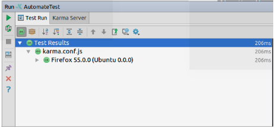
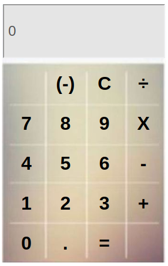
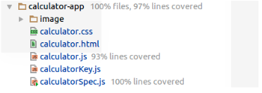

Basic Calculator Application  
============================
> Implements reliable **Basic Calculator Web Application** with software reliability methodology, software development models and system testing techniques with automation testing tools in quality practices.  

***

Table Of Contents 
=================
* [Basic Calculator Application](#basic-calculator-application)
* [Table Of Contents](#table-of-contents)
* [Introduction](#introduction)
* [Getting Started](#getting-started)
  * [Documentation](#documentation)
  * [Infrastructure Setup and Installation](#infrastructure-setup-and-installation)
* [Highlights](#highlights)
  * [Software Resources](#software-resources)
  * [Features](#features)
  * [Screenshot](#screenshot)
* [Testing](#testing)
* [About](#about)
  * [Contributor](#contributor)
  * [Status](#status)
  

***

Introduction
============


&nbsp;&nbsp;&nbsp;&nbsp;&nbsp;&nbsp; A mini basic calculator web application is developed for conducting various testing activities with plans or script in order to refine software quality. The application is build with HTML, CSS, JavaScript with **AngularJS framework and tested with Jasmine Unit Test**.   

&nbsp;&nbsp;&nbsp;&nbsp;&nbsp;&nbsp;External and internal qualities of calculator web application shall be covered with quality factors aspect to meet software requirements and standards. The project attempts to integrate software development process (SDLC) and testing life cycle (STLC) to ensure every single phases conducted are compliance with implicit and explicit requirements.  

&nbsp;&nbsp;&nbsp;&nbsp;&nbsp;&nbsp;Software development decision framework used by this project is **Agile Software Methodology.** The mentioned methodology simplified process decisions around incremental and iterative solution delivery with continuous planning and feedbacks. Agile methodology provide flexibility on product modification and adaptivity based on defects and errors produced in each phase and quickly respond to changes.  

&nbsp;&nbsp;&nbsp;&nbsp;&nbsp;&nbsp;**Agile testing** is used to follow the principles of **Agile Software Development** with **extreme programming method Test-Driven Development (TDD)**. The popularized evolutionary approach is introduced in 2003 which combines testing and development in construction phase in SDLC where we write a test case before writing production code. The behavior and functionality of single unit, module or package has to satisfy test case written with refactoring and defensive programming.  

&nbsp;&nbsp;&nbsp;&nbsp;&nbsp;&nbsp;The process allow developer think through requirements and design before write functional codes, ensure every single test case and codes generated are not redundant.  

***

Getting Started
===============

Documentation
-------------
The documentation contains:-  
1. Master Plan Outline  
2. Detail of Master Test Plan  
3. Functional Requirements and Non-Functional Requirements  
4. Detail of Level Test Plan and Test Case  
5. Testing techniques, designs, tools and Traceability Matrix  

The documentation conform to professional standard with:-
1. IEEE Documentation Standard for Software and System Test 2008, Section 8 Master Test Plan  
2. IEEE Documentation Standard for Software and System Test 2009, Section 9 Level Test Plan 
3. IEEE Documentation Standard for Quality Assurance Process 2014, SQAP Outline Annex B  

Download the document **[HERE](https://github.com/CodesAreHonest/tdd-calculator/blob/master/doc/Test-Document.pdf)**.  

Infrastructure Setup and Installation
-------------------------------------
1. Clone the sourcecode with Git: 
```sh
$ git clone https://github.com/CodesAreHonest/tdd-calculator.git
```  
2. Launch the calculator.html under the **tdd-calculator/app/calculator-app/** directory  
3. Ensure all the testing software resources listed below (under Highlight section) are installed. 
4. Follow the installation steps stated in Section 2.4 in Testing Documentation.
5. Once the setup is done, the PhpStorm shall allow developer to run the automated test with its integrated terminal.  

<p align="center"></p>  

***

Highlights
==========
Software Resources
------------------
1. Linux Ubuntu 16.04.3 LTS 64-bit  
2. IntelliJ PhpStorm Ultimate version  
3. Jasmine Core 2.4.1  
4. Karma Server v0.13.22  
5. Karma Jasmine v0.3.8  
6. Karma-firefox-launcher  
7. Karma-opera-launcher  
8. Node.js v6.11.3 LTS

Features
--------
A calculator is small devices with a keyboard and a visual display that perform arithmetic operations with numbers. The application allow user to perform calculations with basic arithmetic operations.  

The key features of basic calculator application are as follow: 
1. Addition  
2. Subtraction  
3. Multiplication  
4. Division  

Screenshot
----------
The image below is the screenshot of Basic Calculator Application.  
<p align="center"></p>  

***

Testing
=======
The application is tested with various type of testing methods including:-  
  
**1. Unit Test**  
&nbsp;&nbsp;&nbsp;&nbsp;&nbsp;&nbsp;1.1 Automation Unit Testing  
&nbsp;&nbsp;&nbsp;&nbsp;&nbsp;&nbsp;1.2 Maintainability Testing  

**2. Integration Test**  
&nbsp;&nbsp;&nbsp;&nbsp;&nbsp;&nbsp;2.1 Recovery Testing   
&nbsp;&nbsp;&nbsp;&nbsp;&nbsp;&nbsp;2.2 Portability Testing   

**3. System Test**  
&nbsp;&nbsp;&nbsp;&nbsp;&nbsp;&nbsp;3.1 Compliance and Conformance Testing  

**4. Acceptance Testing**  
&nbsp;&nbsp;&nbsp;&nbsp;&nbsp;&nbsp;4.1 Usability Testing  
&nbsp;&nbsp;&nbsp;&nbsp;&nbsp;&nbsp;4.2 Documentation Testing  

Unit test code coverage for entire project are 97%.  
<p align="center"></p>  


The test case and test results are included in _Testing Document_ Section 4 and Section 6. 

***

About
=====
Contributor
-----------
- **Chai Ying Hua**
- **Shubar, Abduelhakem G Abdusalam**

Status
------
This project had stop maintaining and delivered as coursework to Multimedia University. 


